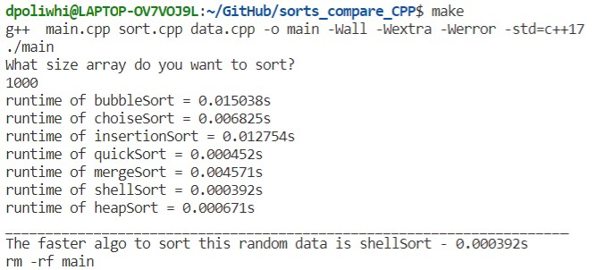

# **Sort_compare**
## Program description

The program implements the sorting of a random array by different sorting algorithms and finds the fastest option  

----------
## Data to sort
The user is given the opportunity to set the size of the array for sorting **N**  
Program sets *random* data with ***int** digits from 0 to N**  

-------
## Sorting algorithms
* Bubble sort (complexity - *O(n2)*)
* Selection sort (complexity - *O(n2)*)
* Insertion sort (complexity - *O(n2)*)
* Quick sort (complexity - *O(n * logn)*)
* Merge sort (complexity - *O(n * logn)*)
* Shell sort (complexity - *O(n2)*)
* Heap sort (complexity - *O(n * logn)*)

-------
## Run the program

To start the app launch *make* and type the *size* of array 
Then program will sort the data and return the time of each option 
Finally, the program will return the fastest sorting option for the given random array 

